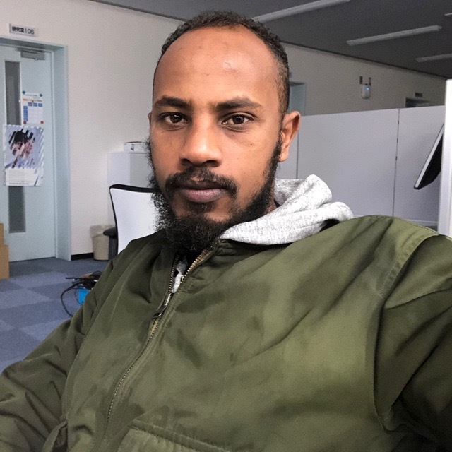

<div style="width: 30%; float: right;">


#### Sponsors

```{r ut_sponsors, echo=FALSE, out.width = '52%', fig.align='left'}
knitr::include_graphics("imgs/ut2.png")
```

-----

```{r uga_sponsors, echo=FALSE, out.width = '42%', fig.align='left'}
knitr::include_graphics("imgs/uga2.png")
```

-----

```{r cnrs, echo=FALSE, out.width = '42%', fig.align='left'}
knitr::include_graphics("imgs/cnrs.png")
```

-----


```{r region, echo=FALSE, out.width = '72%', fig.align='left'}
knitr::include_graphics("imgs/region.png")
```

-----


```{r c_air, echo=FALSE, out.width = '50%', fig.align='left'}
knitr::include_graphics("imgs/c_air.png")
```


</div>


 
<div style="width: 63%; float: left;">

<br/>

-----

## Co-chairs

-----

<div>

<div style="width: 33%; float: left"> 

#### Bojan Batalo	
PhD Student
```{r Bojan, echo=FALSE, out.width = '89%', fig.align='left'}

```

</div>

<div style="width: 33%; float: left"> 

#### Joshua Butke	
PhD Student
```{r Butke, echo=FALSE, out.width = '67%', fig.align='left'}

```

</div>

<div style="width: 33%; float: right"> 

#### Jouni	Mohamad
Post-Doc	Student
```{r JOUNI, echo=FALSE, out.width = '86%', fig.align='left'}

```

</div>

<br/>

<br/>
<br/>

<br/>
<br/>
<br/>


-----

<br/>

<br/>
<br/>

<br/>


It is our great pleasure to warmly invite you to the 2020 UGA & UT Workshop, between the University of Grenoble Alpes (UGA) and the University of Tsukuba (UT) as part of their academic partnership. Here, we hope to promote the international exchange of expertise even further. Our vision is that this student-organized event will create new research opportunities, encourage open and independent mindsets, and increase the scientific network among our working groups.


-----

## General Organization

-----

<div style="width: 33%; float: left;"> 

### University of Tsukuba

#### Lavinas Yuri
PhD Student
```{r Lavinas, echo=FALSE, out.width = '67%', fig.align='left'}
knitr::include_graphics("imgs/myself3.png")
```

-----

#### Shimomoto Erica	
PhD	Student
```{r Shimomoto, echo=FALSE, out.width = '55%', fig.align='left'}
knitr::include_graphics("imgs/erica.jpg")
```

-----


#### Bourahmoune Katia
PhD	Student
```{r Bourahmoune, echo=FALSE, out.width = '60%', fig.align='left'}
knitr::include_graphics("imgs/katia2.png")
```

-----


#### Pereira Jair
PhD Student
```{r Pereira, echo=FALSE, out.width = '60%', fig.align='left'}
knitr::include_graphics("imgs/jair.jpeg")
```

-----

#### Maha Mahyub
Master Student
```{r maha, echo=FALSE, out.width = '60%', fig.align='left'}
knitr::include_graphics("imgs/maha.jpg")
```

-----


#### Mehari Yohannes
PhD Student
```{r mehari, echo=FALSE, out.width = '60%', fig.align='left'}

```

-----


#### Abe Mitsu Teru
Master Student
```{r abe, echo=FALSE, out.width = '60%', fig.align='left'}

```

-----

#### Yifan
PhD Student
```{r yifan, echo=FALSE, out.width = '60%', fig.align='left'}

```

-----


#### Hajime Karamatsu
Master Student
```{r hajime, echo=FALSE, out.width = '60%', fig.align='left'}

```

-----

#### Shizuka Akahori
Master Student
```{r Shizuka, echo=FALSE, out.width = '60%', fig.align='left'}

```

-----


</div>

<div style="width: 33%; float: left;"> 

### University of Grenoble-Alpes


#### Resendiz	Mariel
PhD Student
```{r RESENDIZ, echo=FALSE, out.width = '34%', fig.align='left'}
knitr::include_graphics("imgs/mariel.JPG")
```

-----

</div>

<div style="width: 33%; float: right;"> 

### Ruhr-Universität Bochum


#### Jan Freiwald
PhD Student
```{r Freiwald, echo=FALSE, out.width = '61%', fig.align='left'}

```

-----

</div>


</div>
