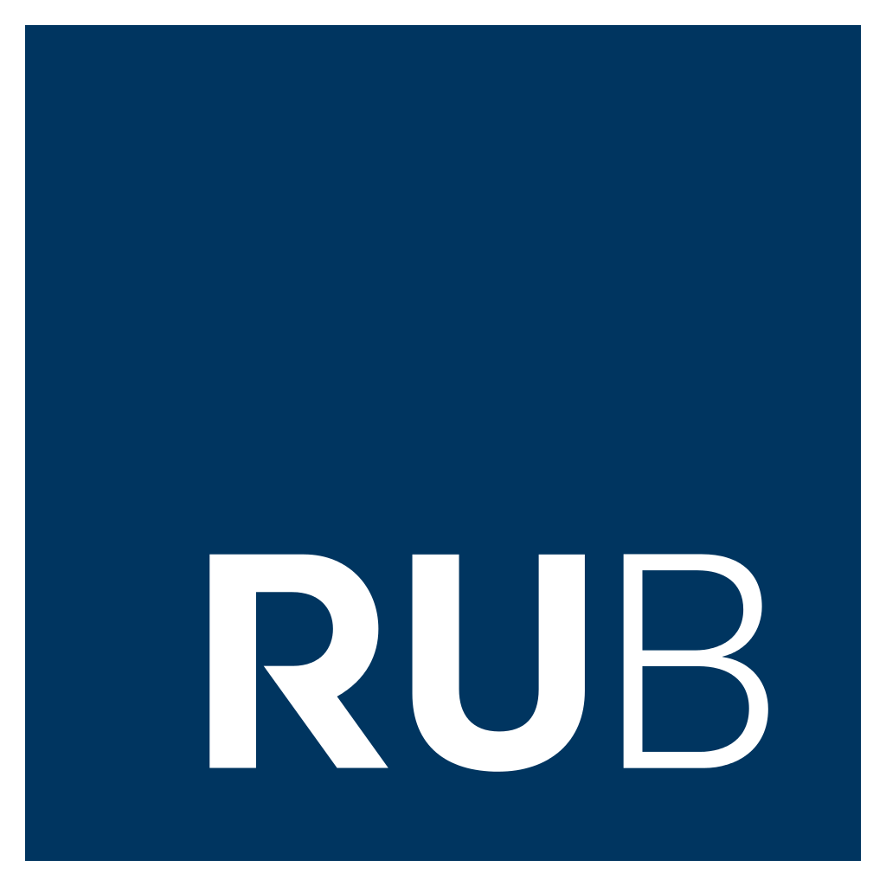

<div style="width: 30%; float: right;">

#### Sponsors

```{r ut_sponsors, echo=FALSE, out.width = '52%', fig.align='left'}
knitr::include_graphics("imgs/ut2.png")
```

-----

```{r uga_sponsors, echo=FALSE, out.width = '42%', fig.align='left'}
knitr::include_graphics("imgs/uga2.png")
```

-----


```{r rub_sponsors, echo=FALSE, out.width = '42%', fig.align='left'}

```

-----

```{r cnrs, echo=FALSE, out.width = '42%', fig.align='left'}
knitr::include_graphics("imgs/cnrs.png")
```

-----


```{r region, echo=FALSE, out.width = '72%', fig.align='left'}
knitr::include_graphics("imgs/region.png")
```

-----


```{r c_air, echo=FALSE, out.width = '50%', fig.align='left'}
knitr::include_graphics("imgs/c_air.png")
```


</div>


 
<div style="width: 65%; float: left;">


The 2021 International Collaborative Workshop of RUB-UGA-UT, 3rd Edition - Recent Trends in Computer Science and Artificial Intelligence (CollaboTICS 2021) is a collaborative workshop between the University of Grenoble-Alpes, Ruhr-Universität Bochum and the University of Tsukuba.

Our workshop will consist of sessions of oral presentations and poster presentations. Students, young researchers, and professors from both universities are welcome to present their current or past research in our workshop! We hope that through our workshop, students and professors from both universities can discuss their respective research topics and find opportunities for future collaborations.


### Worshop Implementation

The CollaboTICS 2021 is pleased to announce the full virtual conference program schedule.

### Important Information

#### Workshop dates

- Workshop Dates: 15 December 2021 - 16 December 2021
- Time: 
  - Japan time: 4pm to 9pm.
  - France and German time: 8am to 1 pm. 

#### Submission procedures

If you want to present at our workshop, please fill [this form](https://forms.gle/Tp8p1oDUEjfK3VSn6).

For more information see the [registration](https://CollaboTICS2021.github.io/registration) section.

</div>
